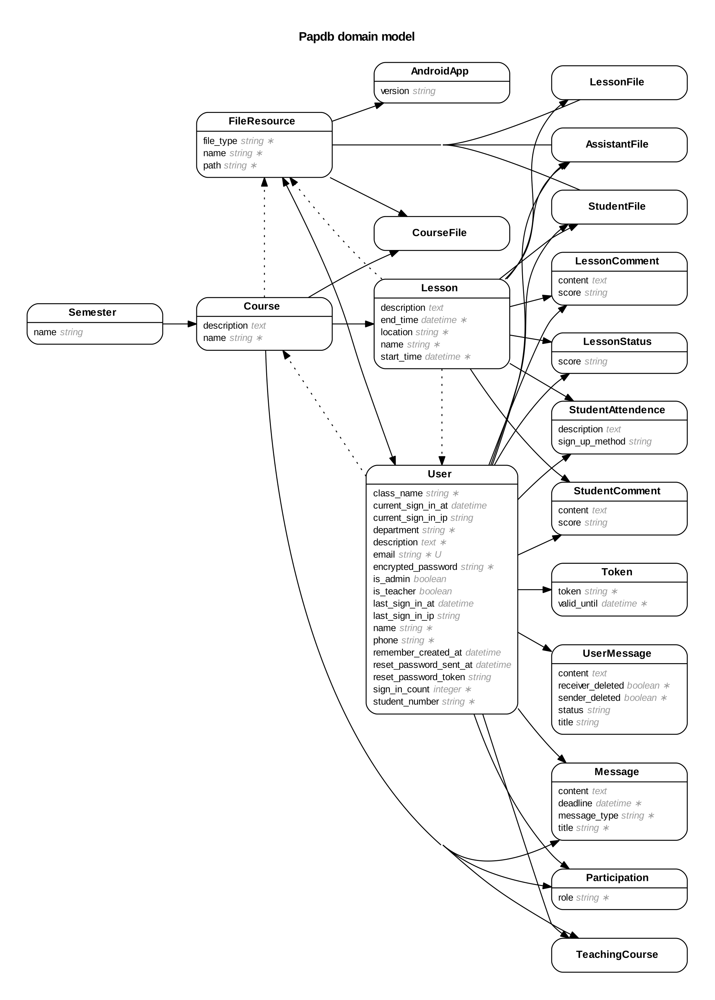

数据库/ActiveRecord设计
---
1. UML

2. 考虑到某门课程的助教可能是另一门课程的学生，
User表储存的是所有用户的信息，包括老师，助教，学生，
用Participation表代表某个用户参与某门课这个关系，Participation表有一个role字段，
该字段表示用户是以什么身份参加的该门课程。取值为assistant和student

3. User Model(app/models/user.rb)的login方法允许用用户用不同方法登陆，比如要增加用户名登陆，只需
在其中加入一个user.username即可

4. Course Model(app/models/course.rb)的students和assistants方法可以简单的获取某门课程的所有学生和助教

5. 其余的Model都是rails标准的使用方法没有多余的方法，很好理解。